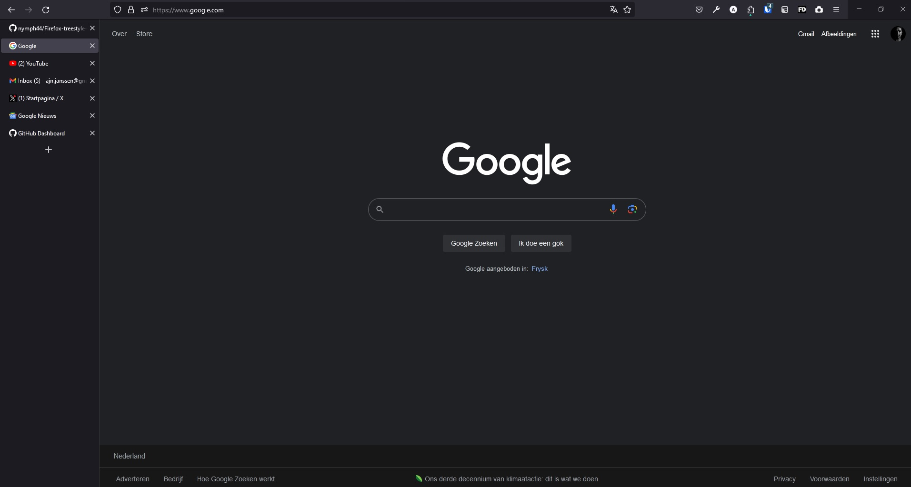

# Custom CSS for Firefox

This repository contains custom CSS files for Firefox to remove the topbar in which the tabs are being displayed. To use this theme, you'll need to have the [Tree Style Tab](https://addons.mozilla.org/en-US/firefox/addon/tree-style-tab/) plugin installed for tab navigation.

## Installation

### Configuration

1. Open Firefox and navigate to `about:config`.
2. Click on "Accept the risk and continue" if prompted.
3. In the search bar, type "toolkit.legacyUserProfileCustomizations.stylesheets" and locate it in the list of preferences.
4. Double-click on the preference to set it to "true."

### Applying the Style

1. Open Firefox and navigate to `about:profiles`.
2. Open the folder associated with your Firefox profile.
3. Inside your profile's root directory, place the folder from this repository called "chrome."

Now, your custom CSS styles should be applied, and the topbar with tabs will be removed when you use the Tree Style Tab plugin.

Feel free to make any additional improvements or clarifications as needed for your specific project.
